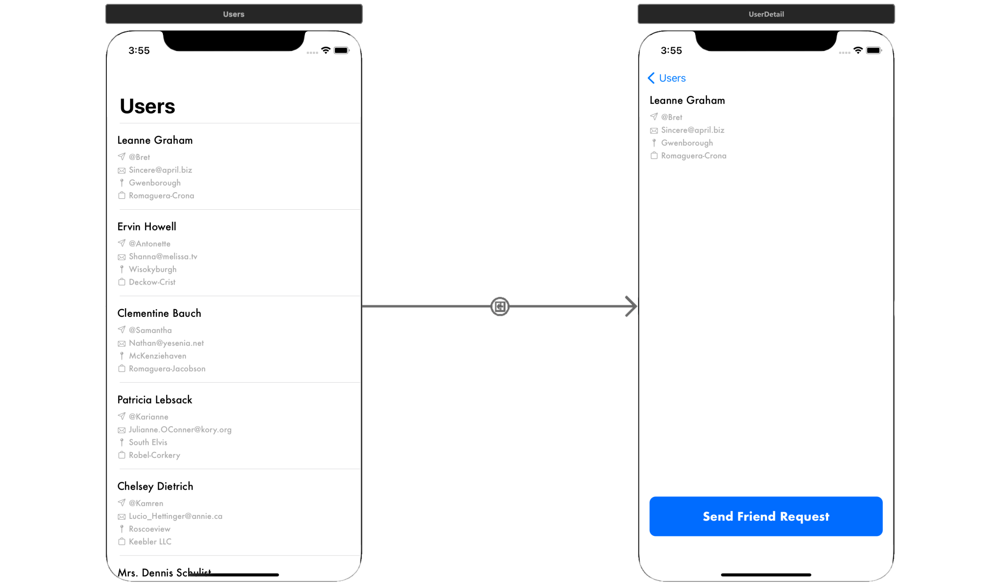
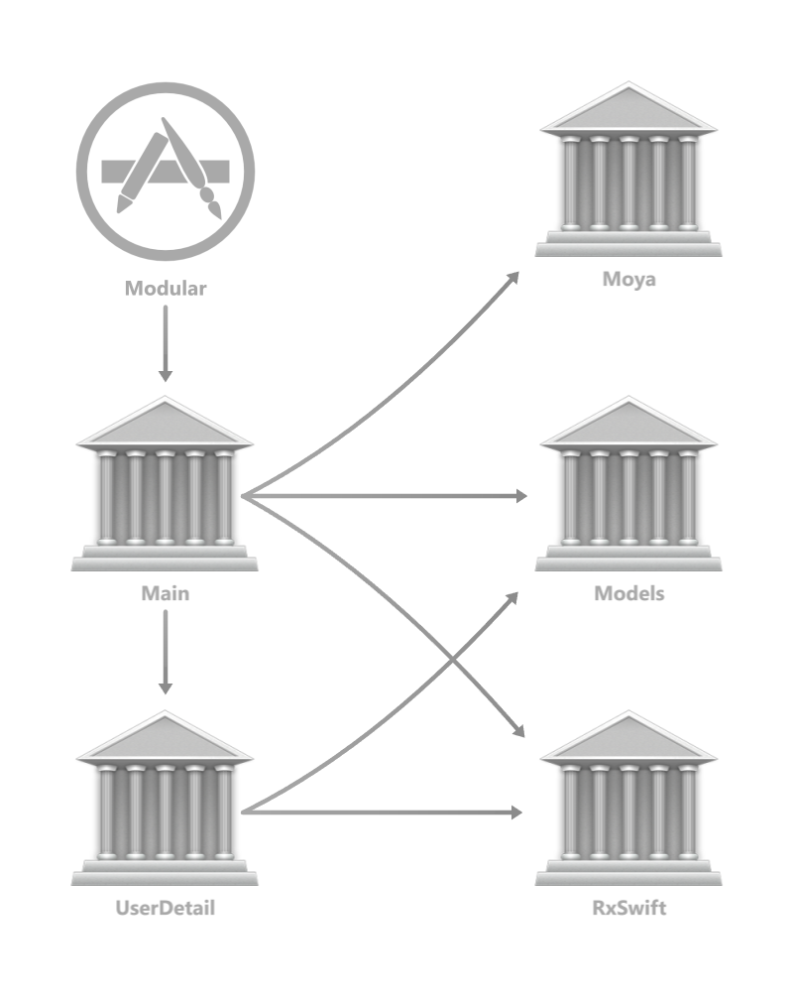
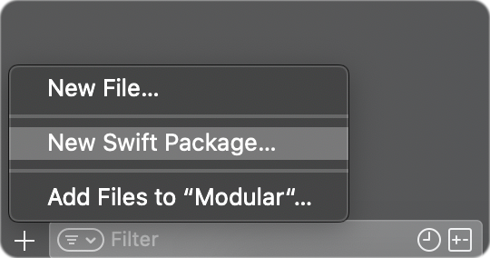
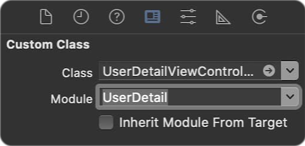

# Modular Architecture With Storyboards
В этом примере разбирается рефакторинг существующего монолитного приложения на отдельные модули. Приложение состоит из двух экранов: `Main`, содержащий список пользователей и `UserDetail`, позволяющий просмотреть детальную информацию о пользователе. Положение осложнено тем, что у нас уже есть 2 зависимости, подключенные через CocoaPods, а верстка реализована с помощью Storyboard:
<p align="center">
  
</p>

### Шаг 1. Отключение CocoaPods
Приложение содержит зависимости `RxSwift` и `Moya`, подключенные с помощью CocoaPods:
```ruby
target 'Modular' do
  use_frameworks!

  pod 'RxSwift', '6.0.0-rc.1'
  pod 'Moya', '~> 14.0'
end
```
Для того чтобы их удалить, нужно выполнить в корневой папке следующую команду:
```bash
pod deintegrate
```
После ее выполнения файл `Modular.xcworkspace` останется нетронутым, что позволит нам использовать его вместо создания собственного Workspace

### Шаг 2. Определение итоговой архитектуры
Целью проводимого рефакторинга является построение архитектуры, в которой каждый экран будет являться отдельным модулем со своими зависимостями. Аналогичным образом в отдельный модуль будут вынесены классы предметной области. Это позволит добиться более удобного переиспользования кода, а также ускорит сборку проекта, так как повторной сборке будут подвергнуты лишь те модули, которые реально были изменены. Схематично новую архитектуру можно изобразить в виде следующего графа:
<p align="center">
  
</p>

### Шаг 3. Создание модуля `Models`
Проще всего начать разделение именно отсюда, так как этот модуль не имеет зависимостей. Для создания нового модуля в текущем Workspace нужно выбрать следующую опцию, нажав на `+` в левом нижнем углу XCode:
<p align="center">
  
</p>

После этого нужно просто переместить файлы в созданную папку `Sources`, исправив, где нужно, модификаторы доступа на `public`
. `Package.swift` для этого модуля также будет выглядеть достаточно просто: <br>

```swift
// swift-tools-version:5.3
import PackageDescription

let package = Package(
    name: "Models",
    products: [
        .library(
            name: "Models",
            targets: ["Models"]
        ),
    ],
    dependencies: [],
    targets: [
        .target(
            name: "Models",
            dependencies: []
        ),
    ]
)
```

### Шаг 4. Создание модуля `UserDetail`
Здесь и далее не будем останавливаться на том, что уже рассматривалось в предыдущих шагах, отметим лишь то, что так как мы используем Storyboards, мы должны явно указать модуль, где содержится нужный нам кастомный класс для контроллера:

<p align="center">
  
</p>

Также, некоторые изменения нужно внести и в `Package.swift`. Из нерассмотренного ранее можно выделить подключение локального пакета в качестве зависимости:

```swift
// swift-tools-version:5.3
import PackageDescription

let package = Package(
    name: "UserDetail",
    defaultLocalization: "en",
    platforms: [.iOS(.v13)],
    products: [
        .library(
            name: "UserDetail",
            targets: ["UserDetail"]),
    ],
    dependencies: [
        .package(url: "https://github.com/ReactiveX/RxSwift.git", .upToNextMajor(from: "5.0.0")),
        .package(path: "../Models")  // <-- Подключение локального пакета
    ],
    targets: [
        .target(
            name: "UserDetail",
            dependencies: [
                "RxSwift",
                .product(name: "RxCocoa", package: "RxSwift"),
                .product(name: "RxRelay", package: "RxSwift"),
                "Models"
            ]),
    ]
)
```

### Шаг 5. Создание модуля `Main`
Здесь все аналогично, отличается он только тем, что в нем больше зависимостей:

```swift
// swift-tools-version:5.3
import PackageDescription

let package = Package(
    name: "Main",
    defaultLocalization: "en",
    platforms: [.iOS(.v13)],
    products: [
        .library(
            name: "Main",
            targets: ["Main"]
        ),
    ],
    dependencies: [
        .package(url: "https://github.com/ReactiveX/RxSwift.git", .upToNextMajor(from: "5.0.0")),
        .package(url: "https://github.com/Moya/Moya.git", .upToNextMajor(from: "14.0.0")),
        .package(path: "../Models"),
        .package(path: "../UserDetail")
    ],
    targets: [
        .target(
            name: "Main",
            dependencies: [
                "RxSwift",
                .product(name: "RxCocoa", package: "RxSwift"),
                .product(name: "RxRelay", package: "RxSwift"),
                "Moya",
                "Models",
                "UserDetail"
            ]
        ),
    ]
)
```
WIP
